04-10

# day01

***

Java是SUN(Stanford University Network，斯坦福大学网络公司 ) 1995年推出的一门高级编程语言。

***

Java语言概述:Java简史

```
1991年 Green项目，开发语言最初命名为Oak (橡树)
1994年，开发组意识到Oak 非常适合于互联网
1996年，发布JDK 1.0，约8.3万个网页应用Java技术来制作
1997年，发布JDK 1.1，JavaOne会议召开，创当时全球同类会议规模之最
1998年，发布JDK 1.2，同年发布企业平台J2EE
1999年，Java分成J2SE、J2EE和J2ME，JSP/Servlet技术诞生
2004年，发布里程碑式版本：JDK 1.5，为突出此版本的重要性，更名为JDK 5.0
2005年，J2SE -> JavaSE，J2EE -> JavaEE，J2ME -> JavaME
2009年，Oracle公司收购SUN，交易价格74亿美元
2011年，发布JDK 7.0
2014年，发布JDK 8.0，是继JDK 5.0以来变化最大的版本
2017年，发布JDK 9.0，最大限度实现模块化
2018年3月，发布JDK 10.0，版本号也称为18.3
2018年9月，发布JDK 11.0，版本号也称为18.9
```


***

# day02

***

面试题

```
Java内存泄露、内存溢出的例子
```

***

Java关键字

官方地址： https://docs.oracle.com/javase/tutorial/java/nutsandbolts/_keywords.htm

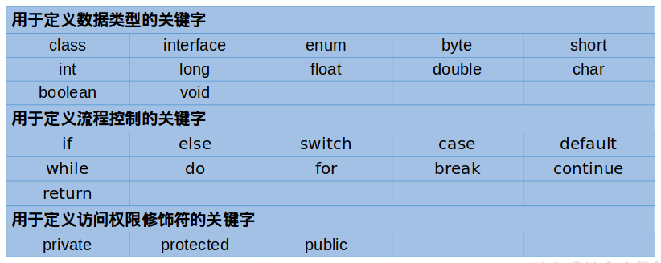

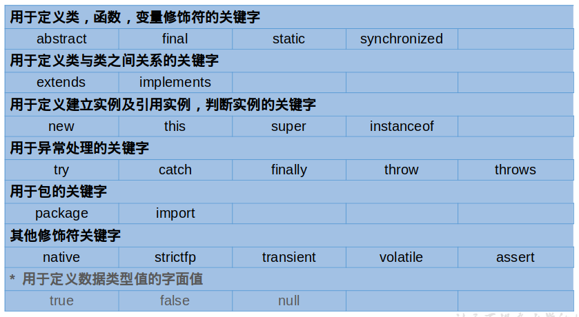

```
abstract表明类或者成员方法具有抽象属性
assert断言，用来进行程序调试
boolean基本数据类型之一，布尔类型
break提前跳出一个块
byte基本数据类型之一，字节类型
case用在switch语句之中，表示其中的一个分支
catch用在异常处理中，用来捕捉异常
char基本数据类型之一，字符类型
class声明一个类
continue回到一个块的开始处
default默认，例如，用在switch语句中，表明一个默认的分支
do用在do-while循环结构中
double基本数据类型之一，双精度浮点数类型
else用在条件语句中，表明当条件不成立时的分支
enum枚举
extends表明一个类型是另一个类型的子类型，这里常见的类型有类和接口
final用来说明最终属性，表明一个类不能派生出子类，或者成员方法不能被覆盖，或者成员域的值不能被改变，用来定义常量
finally用于处理异常情况，用来声明一个基本肯定会被执行到的语句块
float基本数据类型之一，单精度浮点数类型
for一种循环结构的引导词
if条件语句的引导词
implements表明一个类实现了给定的接口
import表明要访问指定的类或包
instanceof用来测试一个对象是否是指定类型的实例对象int基本数据类型之一，整数类型
interface接口
long基本数据类型之一，长整数类型
native用来声明一个方法是由与计算机相关的语言（如C/C++/FORTRAN语言）实现的
new用来创建新实例对象
package包
private一种访问控制方式：私用模式
protected一种访问控制方式：保护模式
public一种访问控制方式：共用模式
return从成员方法中返回数据
short基本数据类型之一,短整数类型
static表明具有静态属性
strictfp关键字可应用于类、接口或方法。如果你想让你的浮点运算更加精确，严格遵守FP-strict的限制,符合IEEE-754规范，而且不会因为不同的硬件平台所执行的结果不一致的话，可以用关键字strictfp
super表明当前对象的父类型的引用或者父类型的构造方法
switch分支语句结构的引导词
synchronized表明一段代码需要同步执行
this指向当前实例对象的引用
throw抛出一个异常
throws声明在当前定义的成员方法中所有需要抛出的异常
transient声明不用序列化的成员域
try尝试一个可能抛出异常的程序块
void声明当前成员方法没有返回值
volatile表明两个或者多个变量必须同步地发生变化
while用在循环结构中
```

***

Java保留字

```
现有Java版本尚未使用，但以后版本可能会作为关键字使用。自己命名标识符时要避免使用这些保留字 
goto 、const
```

***

标识符

Java 对各种变量、方法和类等要素命名时使用的字符序列称为标识符
技巧：凡是自己可以起名字的地方都叫标识符。

定义合法标识符规则

```
由26个英文字母大小写，0-9，_或 $ 组成  
数字不可以开头。
不可以使用关键字和保留字，但能包含关键字和保留字。
Java中严格区分大小写，长度无限制。
标识符不能包含空格。
```

Java中的名称命名规范

```
包名：多单词组成时所有字母都小写：xxxyyyzzz
类名、接口名：多单词组成时，所有单词的首字母大写：XxxYyyZzz
变量名、方法名：多单词组成时，第一个单词首字母小写，第二个单词开始每个单词首字母大写：xxxYyyZzz
常量名：所有字母都大写。多单词时每个单词用下划线连接：XXX_YYY_ZZZ
```

注意1：在起名字时，为了提高阅读性，要尽量有意义，“见名知意”。
注意2：java采用unicode字符集，因此标识符也可以使用汉字声明，但是不建议使用。

***

变量

概念

```
内存中的一个存储区域
该区域的数据可以在同一类型范围内不断变化
变量是程序中最基本的存储单元。包含变量类型、变量名和存储的值
```

作用

```
用于在内存中保存数据
```

使用变量注意

```
Java中每个变量必须先声明，后使用
初始化值
变量的作用域：一对{ }之间有效
同一个作用域内，不能定义重名的变量
使用变量名来访问这块区域的数据
```

分类

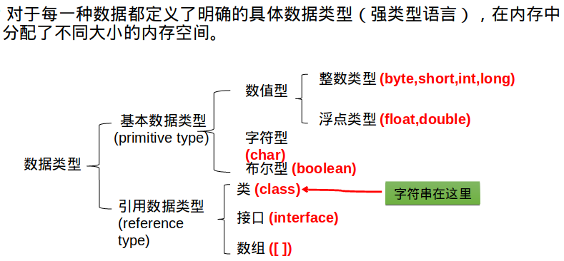

***

整型常量

```
Java各整数类型有固定的表数范围和字段长度，不受具体OS的影响，以保证java程序的可移植性。
java的整型常量默认为 int 型，声明long型常量须后加‘l’或‘L’
java程序中变量通常声明为int型，除非不足以表示较大的数，才使用long
```

***

浮点型常量

```
与整数类型类似，Java 浮点类型也有固定的表数范围和字段长度，不受具体操作系统的影响。

浮点型常量有两种表示形式：
	十进制数形式：如：5.12       512.0f    .512   (必须有小数点）
	科学计数法形式:如：5.12e2      512E2     100E-2
	
float:单精度，尾数可以精确到7位有效数字。很多情况下，精度很难满足需求。    
double:双精度，精度是float的两倍。通常采用此类型。

Java 的浮点型常量默认为double型，声明float型常量，须后加‘f’或‘F’。
```

***

字符型常量

```
1.char 型数据用来表示通常意义上“字符”(2字节)
2.Java中的所有字符都使用Unicode编码，故一个字符可以存储一个字母，一个汉字，或其他书面语的一个字符。
3.字符型变量的三种表现形式：
	字符常量是用单引号(‘ ’)括起来的单个字符。例如：char c1 = 'a';char c2 = '中'; char c3 =  '9';
 	Java中还允许使用转义字符‘\’来将其后的字符转变为特殊字符型常量。例如：char c3 = ‘\n’;  // '\n'表示换行符
	直接使用 Unicode 值来表示字符型常量：‘\uXXXX’。其中，XXXX代表一个十六进制整数。如：\u000a 表示 \n。
4.char类型是可以进行运算的。因为它都对应有Unicode码。
```

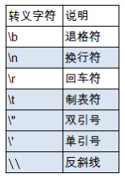

***

# day03

***

在一个Java源文件中最多只能有一个类声明为public。

要求：声明为public的类的类名必须与Java源文件名一致。

***

自动类型提升

自动类型转换：容量小的类型自动转换为容量大的数据类型。数据类型按容量大小排序为： 

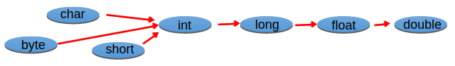

有多种类型的数据混合运算时，系统首先自动将所有数据转换成容量最大的那种数据类型，然后再进行计算。      
byte,short,char之间不会相互转换，他们三者在计算时首先转换为int类型。
boolean类型不能与其它数据类型运算。
当把任何基本数据类型的值和字符串(String)进行连接运算时(+)，基本数据类型的值将自动转化为字符串(String)类型。 

***

强制类型转换

自动类型转换的逆过程，将容量大的数据类型转换为容量小的数据类型。使用时要加上强制转换符：()，但可能造成精度降低或溢出,格外要注意。
通常，字符串不能直接转换为基本类型，但通过基本类型对应的包装类则可以实现把字符串转换成基本类型。
如： String a = “43”; int i = Integer.parseInt(a);
boolean类型不可以转换为其它的数据类型。

***

练习

```java
System.out.println("*\t*");
System.out.println('*' + '\t' + '*');
System.out.println('*' + '\t' + "*");
System.out.println("*" + '\t' + '*');
System.out.println('*' + "\t" + '*');
System.out.println("*" + "\t" + "*");
```

***

进制

```
所有数字在计算机底层都以二进制形式存在。

对于整数，有四种表示方式：
	二进制(binary)：0,1 ，满2进1.以0b或0B开头。
	十进制(decimal)：0-9 ，满10进1.
	八进制(octal)：0-7 ，满8进1. 以数字0开头表示。
	十六进制(hex)：0-9及A-F，满16进1. 以0x或0X开头表示。此处的A-F不区分大小写。如：0x21AF +1= 0X21B0
```

***

二进制

```
Java整数常量默认是int类型，当用二进制定义整数时，其第32位是符号位；当是long类型时，二进制默认占64位，第64位是符号位

二进制的整数有如下三种形式：
	原码：直接将一个数值换成二进制数。最高位是符号位
	负数的反码：是对原码按位取反，只是最高位（符号位）确定为1。
	负数的补码：其反码加1。

计算机以二进制补码的形式保存所有的整数。
	正数的原码、反码、补码都相同
	负数的补码是其反码+1
```

为什么要使用原码、反码、补码表示形式呢？

```
计算机辨别“符号位”显然会让计算机的基础电路设计变得十分复杂! 于是人们想出了将符号位也参与运算的方法. 我们知道, 根据运算法则减去一个正数等于加上一个负数, 即: 1-1 = 1 + (-1) = 0 , 所以机器可以只有加法而没有减法, 这样计算机运算的设计就更简单了。
```


十进制转二进制：除2取余的逆

***

进制的基本转换

```
十进制  二进制互转
	二进制转成十进制  乘以2的幂数
	十进制转成二进制  除以2取余数
二进制  八进制互转
二进制   十六进制互转
十进制 八进制互转
十进制 十六进制互转
```

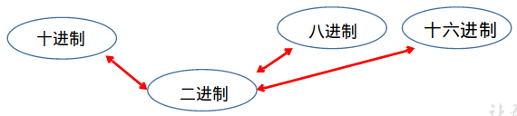


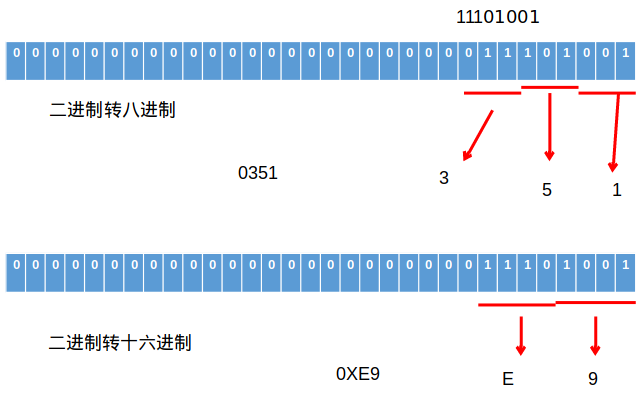

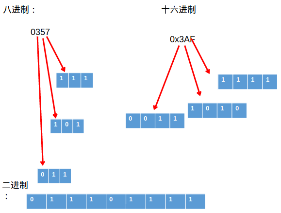

***

运算符

```
运算符是一种特殊的符号，用以表示数据的运算、赋值和比较等。
算术运算符
赋值运算符
比较运算符（关系运算符）
逻辑运算符
位运算符
三元运算符
```

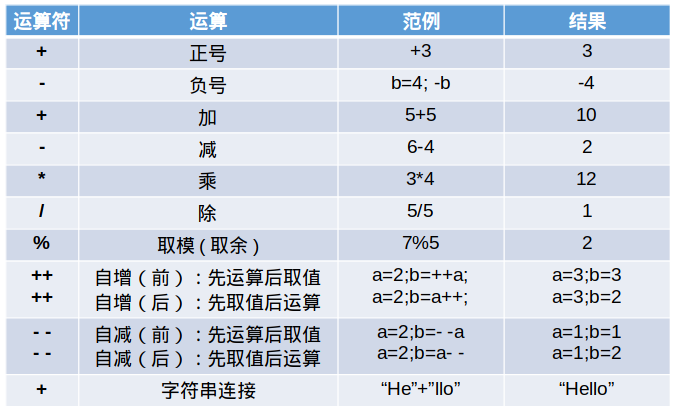

取模符号与被模数有关。

***

赋值运算符

```
符号：= 
	当“=”两侧数据类型不一致时，可以使用自动类型转换或使用强制类型转换原则进行处理。支持连续赋值。

扩展赋值运算符： +=, -=, *=, /=, %=
```


# day04

***

比较运算符

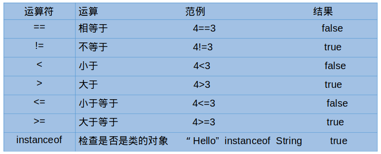

比较运算符的结果都是boolean型，也就是要么是true，要么是false。

***

逻辑运算符

&—逻辑与         | —逻辑或         ！—逻辑非
&& —短路与      || —短路或        ^ —逻辑异或

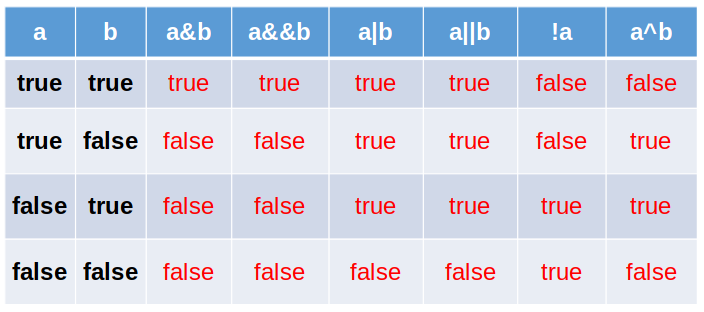

***

位运算符

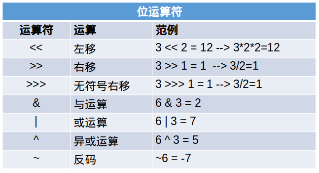

位运算是直接对整数的二进制进行的运算。

注意：

```
无 <<<
```

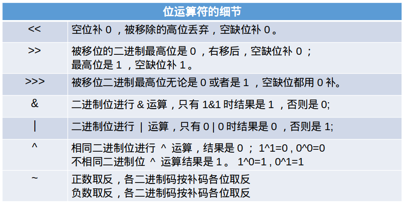

***

运算符的优先级

```
运算符有不同的优先级，所谓优先级就是表达式运算中的运算顺序。如右表，上一行运算符总优先于下一行。  

只有单目运算符、三元运算符、赋值运算符是从右向左运算的。
```

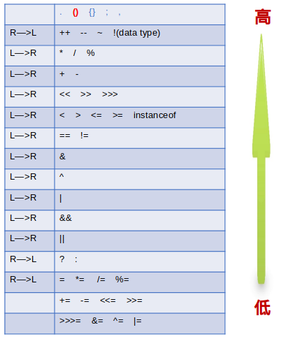


# day13

***

1.为什么要有继承？

```
1）代码复用
2）代码扩展
3）表示is-a 的关系
```

***

2.如何实现继承？

```
在声明一个类时去继承一个类
语法格式
[修饰符] class 子类名 extends 父类名{}
```

***

3.继承的要求

```
子类在继承父类时，一定会在子类的构造器中调用父类的构造器
1）默认情况调用父类的无参构造
2）如果父类没有无参构造，那么子类可以显示的调用有父类的参构造
```

***

4.继承的特点

```
1）子类不会继承父类的构造器，但是在子类构造器中一定会调用父类的构造器
2）子类可以继承父类的所有方法、属性，如果方法或属性是私有的，不能直接使用
3）子类可以扩展父类没有的属性和方法
4）如果父类方法的方法体不适用子类，那么子类可以进行重写
5）Java中继承有单继承的限制，不支持多重继承。即，一个子类只能有一个直接父类
6）Java支持多层继承。即，父类还可以有父类，父类的父类也是子类的父类
7）Java中一个类可以同时有多个子类
```

***

# day16

***

04开始

JDK1.8中修改了接口的语法，增加了两类成员：

1）静态方法：public static（public可以省略，static不能省略）

```tex
不会被子类继承。只能！通过“接口名.方法名”来调用，不能用子类对象调用，也不能用“子类名.方法名”调用。

因为原来API中，往往这样设计类：
	集合接口：Collection，集合工具类：Collections;
	文件路径接口：Path，文件路径工具类：Paths
这样会有两个类，没有必要，可以直接把工具类的方法放到前面的类中，从而减少了.class文件
```

2）默认方法：public default（public可以省略，default不能省略）

```tex
通过“实现类对象.方法名”调用。子类可以对默认方法进行重写。

什么情况下用到默认方法？
	当这个接口的某个抽象方法，在很多子类中的实现代码都是一样的，那么就可以把这个实现挪到接口中，用默认方法实现。如果有子类对该方法的实现不一样，则可进行重写。
```

***

接口默认方法冲突问题

1）当一个类实现了两个接口，这两个接口有方法名签名相同的默认方法

2）当一个类继承了一个类，又实现了一个接口，继承的类和实现的接口中有方法名签名相同的方法

```tex
默认使用父类的实现，也可以手动选择继承的类或者实现的接口中的实现，也可以手动重写
```

***

简单工厂模式

```java
package com.atguigu.pattern;

/*
 * 接口在设计模式中的应用之一：简单工厂模式（了解）
 * 
 * 生活：
 * 无工厂：手工
 * 	  缺点：麻烦，对每个人的要求比较高
 * 	 例如：衣服，鞋子，需要自己会缝，自己做
 *   优点：个性化
 *   
 * 工厂：生产产品
 * 	 优点：批量生产，使用者比较方便，直接买
 *   缺点：无法定制，如果要定制比较麻烦
 *   
 * Java中当创建对象比较麻烦时，或者是需要批量生产对象时，可以交给“工厂类”来生产。  
 * 
 * 
 * 简单工厂类的作用：生产Java的对象，一般是用来生产某个接口的实现类对象。
 * 好处：把对象的使用者与创建者分离，解耦合（把对象的使用者与具体的实现类解耦合）。
 * 例如：TestSimpleFactory类是对象的使用者
 *      SimpleFactory类是对象的创建者
 *      
 * 生活中，生产衣服不是穿衣服的人。
 *      
 */
public class TestSimpleFactory {
	public static void main(String[] args) {
		//没有工厂
//		BMW b = new BMW();//直接new
		
		//现在用工厂类
		Car car = SimpleFactory.getCar("bmw");
		car.run();
		
		Car a = SimpleFactory.getCar("audi");
		a.run();
	}
}
//产品的标准
interface Car{
	void run();
}

//具体的产品类
class BMW implements Car{

	@Override
	public void run() {
		System.out.println("宝马车");
	}
	
}
class Benz implements Car{

	@Override
	public void run() {
		System.out.println("奔驰");
	}
	
}
class Audi implements Car{

	@Override
	public void run() {
		System.out.println("奥迪");
	}
	
}
class DaZhong implements Car{

	@Override
	public void run() {
		System.out.println("大众");
	}
	
}
//工厂类
class SimpleFactory{
	public static Car getCar(String type){
		if("bmw".equals(type)){
			return new BMW();
		}else if("benz".equals(type)){
			return new Benz();
		}else{
			return new Audi();
		}
	}
}
```

***

工厂设计模式

```java
package com.atguigu.pattern;

/*
 * 面向对象的开发原则：
 * （1）面向接口编程
 * （2）对修改关闭，对扩展开发
 * 
 * 简单工厂模式：（了解）
 * （1）接口
 * （2）一系列的实现类
 * （3）一个工厂类，有一个生产对象的方法
 * 
 * 优点：简单
 * 缺点：如果有增加一个产品接口的实现类，需要修改工厂类的代码
 * 
 * 工厂方法设计模式：（了解）
 * （1）接口
 * （2）一系列的实现类
 * （3）每一个实现类，会有自己的工厂类
 * 
 * 优点：如果增加产品的实现类，那么不需要修改工厂类的代码，只需要增加一个对应的工厂类就可以。
 * 缺点：类太多
 */
public class TestFatoryMethod {
	public static void main(String[] args) {
		//多态引用，左边是接口的类型，右边赋值的是实现类的对象
		Car c = BMWFactory.getBMW();
		c.run();
		
		CarFactory bf = new BaoMaFactory();
		Car b = bf.getCar();
		b.run();
	}
}
//形式一：
//每一个实现类，单独编写工厂
class BMWFactory{
	public static BMW getBMW(){
		return new BMW();
	}
}
class BenzFactory{
	public static Benz getBenz(){
		return new Benz();
	}
}
//...


//形式二：
interface CarFactory{
	Car getCar();//生产车
}
//工厂类有很多个，都实现工厂的接口
class BaoMaFactory implements CarFactory{

	@Override
	public Car getCar() {
		return new BMW();
	}
	
}
class BenChiFactory implements CarFactory{

	@Override
	public Car getCar() {
		return new Benz();
	}
	
}
class QQ implements Car{

	@Override
	public void run() {
		System.out.println("qq车");
	}
	
}
class QQFactory implements CarFactory{

	@Override
	public Car getCar() {
		return new QQ();
	}
	
}
```

***

代理设计模式

```java
package com.atguigu.pattern;

/*
 * 静态代理模式：（了解）
 * 
 * 代理：
 * 	代理可以帮助被代理者完成一些前期的准备工作，后期的善后工作。核心的业务逻辑仍然由被代理者完成。
 * 
 * 代码结构：
 * （1）接口：主题
 * （2）被代理者
 * （3）代理者
 * 要求：代理类和被代理类实现同一个主题接口
 *      代理类中要有一个被代理类的属性（target)，这样才能把核心业务代码交给被代理者完成
 * 
 * 这些需求是和核心业务逻辑无关的代码，而且多变，那么这样的代码可以交给代理完成。
 * 需求：（1）要计算add()的运行时间
 *    	（2）记录add()的开始执行，已经结束执行的时间到日志中
 * 
 */
public class TestProxy {
	public static void main(String[] args) {
		//使用代理类和被代理类来完成工作
		UserDAO bei = new UserDAO();//被代理者
		UserDAOProxy up = new UserDAOProxy(bei);//代理者
		up.add();
	}
}
//操作数据库的数据
//接口
interface DAO{
	void add();
}
//被代理者
class UserDAO implements DAO{

	@Override
	public void add() {
		System.out.println("添加用户");
	}
	
}
//代理者
class UserDAOProxy implements DAO{
	private UserDAO target;//被代理者

	public UserDAOProxy(UserDAO target) {
		super();
		this.target = target;
	}

	@Override
	public void add() {
		System.out.println("add方法开始执行");
		long start = System.currentTimeMillis();
		
		//核心业务逻辑要交还给被代理者完成
		target.add();
		
		long end = System.currentTimeMillis();
		System.out.println("耗时：" + (end-start));
		System.out.println("add方法结束执行");
	}
	
}
```

***

内部类

概述

```java
/*
 * 类的成员：
 * （1）属性（必用）
 * （2）构造器（必用）
 * （3）方法（必用）
 * （4）代码块（比较少）
 * （5）内部类（比较少）
 * 
 * 修饰符：
 * static（重要）
 * final（重要）
 * abstract（重要）
 * interface（重要）
 * native（了解） 
 * 
 * 1、内部类：
 * 	当一个类的内部，仍然有一个完整的结构，这个完整的结构仍然需要一个类进行描述，因为有自己的特征（属性，方法），并且这个内部类是为外部类服务的。
 * 
 * 内部类：集合
 * 
 * 身体（Body）里面有各种器官，例如：心脏，也是一个独立的结构，也需要用一个类描述。而且这个心脏是为Body服务，离开Body没有意义。
 * 
 * 2、分类
 * 根据位置：
 * （一）成员内部类
 * 	和成员变量一样，在类中，方法外
 * 1、静态成员内部类：简称静态内部类
 * 2、非静态成员内部类：简称成员内部类
 * （二）局部内部类
 * 在方法内
 * 1、有名字的局部内部类：简称局部内部类（很少）
 * 2、没名字的局部内部类：简称匿名内部类
 * 
 */
```

***

非静态内部类

```java
package com.atguigu.inner2;

import com.atguigu.inner2.Outer.Inner;

/*
 * 一、成员内部类（非静态）
 * 1、如何声明？
 * 【修饰符】 class 外部类   【extends 父类】 【implements 父接口们】{
 * 
 * 			【修饰符】  class 内部类   【extends 父类】 【implements 父接口们】{
 * 			}
 * }
 * 
 * 说明：非静态内部类的修饰符
 * （1）权限修饰符：4个
 * （2）static没有
 * （3）abstract可以有
 * （4）final可以有
 * 
 * 2、成员
 * 类的5大成员都可以，但是不允许有静态成员!
 * （1）属性：非静态的属性
 * （2）方法：非静态的方法
 * 		  在抽象的内部类中，还可以有抽象方法
 * （3）代码块：非静态
 * （4）构造器：无参、有参
 * （5）内部类：语法上可以，但是太复杂了，不这么写
 * 
 * 3、使用
 * （1）在非静态内部类中可以使用外部类的所有成员
 * （2）在外部类中，使用非静态内部类有限制.在外部类的静态方法中不允许使用非静态的内部类
 * （3）在外部类的外面使用非静态内部类，声明变量和静态内部类的一样
 * 		Outer.Inner in;
 * （4）在外部类的外面要调用非静态内部类的非静态方法，需要外部类的对象和内部类的对象
 * 	例如：Outer out = new Outer();
 * 		Outer.Inner in = out.new Inner();
		obj.test();
 * 
 * 4、说明：
 * 非静态内部类也有自己的字节码文件
 *  外部类$非静态内部类.class
 */
public class TestNonStaticMemberInner {
	public static void main(String[] args) {
//		Outer.Inner in;
		
		//调用Inner的test()方法
		//(1)问？是否需要外部类Outer的对象
		//答：要，因为Inner是Outer的非静态的成员
		Outer out = new Outer();
		//(2)问？是否需要Inner的对象
		//答：要，因为test()是Inner的非静态
		Outer.Inner in = out.new Inner();
		
		in.test();
		
		//因为“对象.new 内部类”太怪了，然后实际编写时，不这样写
		Outer.Inner in2 = out.getInner();
		in2.test();
		
		//如果想要简化Outer.Inner的写法
		//可以使用导包语句：import 包.Outer.Inner;
		Inner in3 = out.getInner();
		in3.test();
	}
}
class Outer{
	private static int i;
	private int j;
	class Inner{
		public void test(){
			System.out.println(i);
			System.out.println(j);
		}
	}
	
	//方法的作用：为外界提供内部类的对象
	public Inner getInner(){
		Inner in = new Inner();
		return in;
	}
	
	//在外部类的静态方法中，不能使用非静态的内部类
	/*public static Inner getInner2(){
		Inner in = new Inner();
		return in;
	}*/
}
```

***

静态内部类

```java
package com.atguigu.inner1;

/*
 * 一、静态内部类
 * 1、如何声明？
 * 【修饰符】 class 外部类   【extends 父类】 【implements 父接口们】{
 * 
 * 			【修饰符】  static class 内部类   【extends 父类】 【implements 父接口们】{
 * 			}
 * }
 * 
 * 说明：静态内部类的修饰符
 * （1）权限修饰符：4个
 * （2）static必须有
 * （3）abstract可以有
 * （4）final可以有
 * 
 * 2、成员
 * 类的5大成员都可以
 * （1）属性：静态和非静态的属性
 * （2）方法：静态的和非静态的方法
 * 		  在抽象的静态内部类中，还可以有抽象方法
 * （3）代码块：静态的和非静态
 * （4）构造器：无参、有参
 * （5）内部类：语法上可以，但是太复杂了，不这么写
 * 
 * 3、使用
 * （1）在静态内部类中不允许使用外部类的非静态的成员
 * （2）在外部类中，使用静态内部类和使用其他的类一样
 * （3）在外部类的外面使用静态内部类，不需要外部类的对象
 * Outer.Inner 
 * （4）在外部类的外面要调用静态内部类的非静态方法，需要静态内部类的对象
 * 	例如：Outer.Inner obj = new Outer.Inner();
		obj.test();
 * （5）在外部类的外面要调用静态内部类的静态方法，不需要静态内部类的对象
 * 例如：Outer.Inner.method();
 * 
 * 4、说明：
 * 静态内部类也有自己的字节码文件
 *  外部类$静态内部类.class
 */
public class TestStaticInner {
	public static void main(String[] args) {
		Outer.print();
		
		//调用Inner的test()方法
		//(1)问？是否需要外部类Outer的对象
		//答：不要，因为Inner是Outer的静态成员
		//(2)问？是否需要内部类Inner的对象
		//答：要，因为test方法本身不是静态的
		Outer.Inner obj = new Outer.Inner();
		obj.test();
		
		//调用Inner的method()方法
		//(1)问？是否需要外部类Outer的对象
		//答：不要，因为Inner是Outer的静态成员
		//(2)问？是否需要内部类Inner的对象
		//答：不要，因为method方法是静态的		
		Outer.Inner.method();
	}
}
class Outer{
	private static int i;
	private int j;
	
	static class Inner{
		public void test(){
			System.out.println(i);//直接使用外部类的私有的成员
//			System.out.println(j);//错误的，static的不能直接使用非static
		}
		
		public static void method(){
			System.out.println("内部类的静态方法");
		}
	}
	abstract static class In{
		
	}
	
	public static void print(){
		System.out.println("外部类的静态方法");
	}
	
	public Inner getInner(){
		Inner in = new Inner();
		return in;
	}
}
```

***

面试题

```java
package com.atguigu.mianshi;

public class TestMianShi1 {

}
class Outer{
	abstract class Inner{
		public abstract void test();
	}
}

/*
 * 考点：
 * （1）子类继承抽象类，需要重写抽象的抽象方法
 * （2）子类继承父类时，在子类的构造器中，必须调用父类的构造器
 * （3）要使用非静态的内部类的构造器，需要外部类的对象
 */
class MyInner extends Outer.Inner{
	
	MyInner(Outer out){
		out.super();//用外部类的对象，才能调用内部类的构造器
	}
	
	public void test(){
		System.out.println("....");
	}
}
```

***


