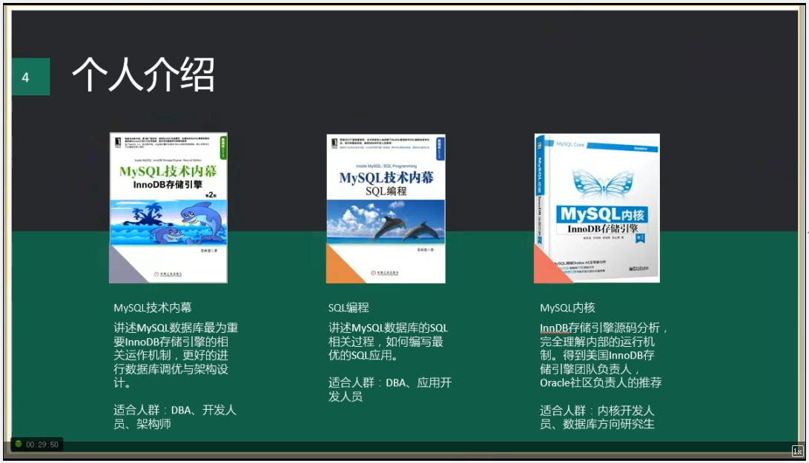
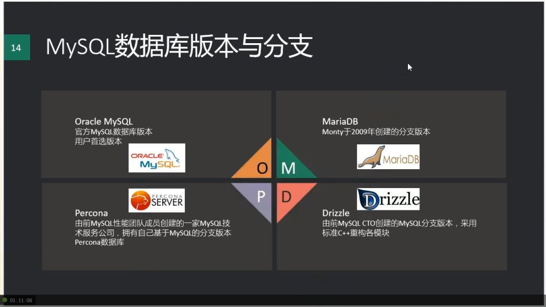

# 01_20151020

***








***

# 02_20151110

***

MySQL官方社区版本不支持线程池。


下载文件在官网下载，不要用迅雷下载。下载后校验MD5值

mysql 5.6.27

unlink命令使用

iostat -xm 3 查看磁盘负载

最优my.cnf

```
[client]
user=david
password=88888888

[test1]
user=david
password=123
host=10.166.224.32
port=3306

[test2]
user=david
password=123
host=10.166.224.33
port=3306

[test3]
user=david
password=123
host=10.166.224.34
port=3306

[mysqld]
########basic settings########
server-id = 11 
port = 3306
user = mysql
bind_address = 10.166.224.32
# 5.6时注释下面一行
autocommit = 0
character_set_server=utf8mb4
skip_name_resolve = 1
max_connections = 800
max_connect_errors = 1000
datadir = /data/mysql_data
transaction_isolation = READ-COMMITTED
explicit_defaults_for_timestamp = 1
join_buffer_size = 134217728
tmp_table_size = 67108864
tmpdir = /tmp
max_allowed_packet = 16777216
sql_mode = "STRICT_TRANS_TABLES,NO_ENGINE_SUBSTITUTION,NO_ZERO_DATE,NO_ZERO_IN_DATE,ERROR_FOR_DIVISION_BY_ZERO,NO_AUTO_CREATE_USER"
interactive_timeout = 1800
wait_timeout = 1800
read_buffer_size = 16777216
read_rnd_buffer_size = 33554432
sort_buffer_size = 33554432
########log settings########
log_error = error.log
slow_query_log = 1
slow_query_log_file = slow.log
log_queries_not_using_indexes = 1
log_slow_admin_statements = 1
log_slow_slave_statements = 1
log_throttle_queries_not_using_indexes = 10
expire_logs_days = 90
long_query_time = 2
min_examined_row_limit = 100
########replication settings########
master_info_repository = TABLE
relay_log_info_repository = TABLE
log_bin = bin.log
sync_binlog = 1
gtid_mode = on
enforce_gtid_consistency = 1
log_slave_updates
binlog_format = row 
relay_log = relay.log
relay_log_recovery = 1
binlog_gtid_simple_recovery = 1
slave_skip_errors = ddl_exist_errors
########innodb settings########
innodb_page_size = 8192
innodb_buffer_pool_size = 6G
innodb_buffer_pool_instances = 8
innodb_buffer_pool_load_at_startup = 1
innodb_buffer_pool_dump_at_shutdown = 1
innodb_lru_scan_depth = 2000
innodb_lock_wait_timeout = 5
innodb_io_capacity = 4000
innodb_io_capacity_max = 8000
innodb_flush_method = O_DIRECT
innodb_file_format = Barracuda
innodb_file_format_max = Barracuda
innodb_log_group_home_dir = /redolog/
# 设置成功后不能再修改
innodb_undo_directory = /undolog/
innodb_undo_logs = 128
innodb_undo_tablespaces = 3
innodb_flush_neighbors = 1
# 线上环境至少2G
innodb_log_file_size = 4G
innodb_log_buffer_size = 16777216
innodb_purge_threads = 4
innodb_large_prefix = 1
innodb_thread_concurrency = 64
innodb_print_all_deadlocks = 1
innodb_strict_mode = 1
innodb_sort_buffer_size = 67108864 
########semi sync replication settings########
plugin_dir=/usr/local/mysql/lib/plugin
plugin_load = "rpl_semi_sync_master=semisync_master.so;rpl_semi_sync_slave=semisync_slave.so"
loose_rpl_semi_sync_master_enabled = 1
loose_rpl_semi_sync_slave_enabled = 1
loose_rpl_semi_sync_master_timeout = 5000

# 只对5.7版本生效
[mysqld-5.7]
innodb_buffer_pool_dump_pct = 40
innodb_page_cleaners = 4
innodb_undo_log_truncate = 1
innodb_max_undo_log_size = 2G
innodb_purge_rseg_truncate_frequency = 128
binlog_gtid_simple_recovery=1
log_timestamps=system
transaction_write_set_extraction=MURMUR32
show_compatibility_56=on
```


mysqldump 使用时可能与安装版本不一致

安装5.7.9

# 03_20151112

安装5.7.9


# 03_20151114


mysql升级

1. 安全关闭旧版本mysql.
2. 确认配置文件的数据目录位置是旧版本的位置
3. 启动新版本
4. 运行 mysql_upgrade -s -p 命令（只升级系统表，更新数据库mysql的元数据，先在从库上升级）

回退 -> 官方文档（存在问题）


datadir innodb_log_group_home_dir innodb_undo_directory 目录需要权限是 mysql : mysql

mysql硬盘推荐用ssd

// 查看所有参数

show variables

# 04_20151117


create user 'perf'@'127.0.0.1' // 创建用户

grant select on sys.* to 'perf'@'127.0.0.1' //用户授权

show grants for 'perf'@'127.0.0.1'; // 查看权限


